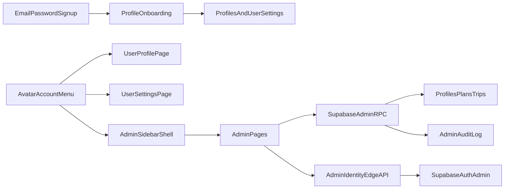

# IAM/RBAC + Entitlement Management Plan

## Locked decisions

- User provisioning supports **both** admin invite and direct creation flows.
- Deletion defaults to **soft-delete**, with explicit hard-delete as a secondary confirmed action.
- Signup stays minimal (email/password); required profile data moves to a **post-login onboarding** step.
- Tier updates must support **backfill on existing users/trips**.
- Admin experience should use a **full-width shadcn dashboard aesthetic** with persistent sidebar and extensible section structure.
- Global auth controls should move to an **avatar-based account menu** (role-aware entries for admins vs normal users).

## Current foundation to extend

- Existing admin RPCs are already in place in [docs/supabase.sql](docs/supabase.sql): `admin_list_users`, `admin_update_user_tier`, `admin_update_user_overrides`, `admin_update_plan_entitlements`.
- Existing admin UI lives in [pages/AdminAccessPage.tsx](pages/AdminAccessPage.tsx) and currently uses a simple user list + edit panel (no full data table).
- Admin routes and guard are already present in [App.tsx](App.tsx) and [components/admin/AdminMenu.tsx](components/admin/AdminMenu.tsx).
- Trip ownership and status controls are in [docs/supabase.sql](docs/supabase.sql) and [services/dbService.ts](services/dbService.ts), but no admin trip-management RPC surface exists yet.
- Current authenticated header/menu controls are in [components/navigation/SiteHeader.tsx](components/navigation/SiteHeader.tsx) and [components/navigation/MobileMenu.tsx](components/navigation/MobileMenu.tsx), where logout is still a direct button.

## Phase 1: Data model and RBAC primitives (SQL)

- Extend [docs/supabase.sql](docs/supabase.sql) with profile and status fields required for onboarding + admin lifecycle:
  - `first_name`, `last_name`, `username` (nullable + unique index), `gender`, `country`, `city`, `preferred_language`.
  - `account_status` (`active`, `disabled`, `deleted`), `disabled_at`, `disabled_by`, `onboarding_completed_at`.
- Add RBAC v1 for admin capability partitioning (future-proof beyond binary admin/user):
  - role/permission tables and seed roles (`super_admin`, `support_admin`, `read_only_admin`) with permission keys for users, trips, tiers, and audit logs.
  - helper SQL function `has_admin_permission(...)` used by admin RPCs.
- Add immutable audit table (for all admin mutations):
  - `admin_audit_logs` with actor, action, target type/id, before/after JSON snapshots, metadata, timestamp, request id.
  - indexes for actor/date/target/action filters.

## Phase 2: Admin RPC surface for user/trip/tier operations

- Expand [docs/supabase.sql](docs/supabase.sql) with admin RPCs (security definer + permission checks + audit writes):
  - user list/details APIs with server-side search/sort/filter/pagination.
  - user profile update API (new onboarding fields + role/tier + overrides).
  - user soft-delete/restore API; hard-delete API wrapper trigger point.
  - admin trip list/update APIs (status, `trip_expires_at`, owner transfer, archive/restore/hard-delete).
  - tier read/update APIs + **reapply/backfill API** for existing users/trips.
- Keep owner RLS strict for normal users; perform admin mutations through explicit RPCs (no broad RLS bypass policy).
- Ensure every mutating admin RPC writes to `admin_audit_logs` with before/after payloads.

## Phase 3: Edge API for Supabase Auth admin operations

- Add new edge function (for operations not possible via anon-key RPC), e.g. [netlify/edge-functions/admin-iam.ts](netlify/edge-functions/admin-iam.ts):
  - invite user flow (`send invite/set-password link`).
  - direct user creation flow (admin sets password, optional force reset marker).
  - hard delete auth user flow.
- Reuse bearer-token admin verification pattern from [netlify/edge-functions/ai-benchmark.ts](netlify/edge-functions/ai-benchmark.ts).
- Add server env requirements/docs updates:
  - [netlify.toml](netlify.toml), [.env.example](.env.example), [docs/EDGE_FUNCTIONS.md](docs/EDGE_FUNCTIONS.md), [README.md](README.md).

## Phase 4: Admin UX rebuild (functional-first, brand-aligned)

- Replace/expand [pages/AdminAccessPage.tsx](pages/AdminAccessPage.tsx) into a **full-width dashboard shell** modeled after the shadcn dashboard information architecture ([reference](https://ui.shadcn.com/examples/dashboard)):
  - persistent sidebar with grouped navigation (`Overview`, `Users`, `Trips`, `Tiers`, `Audit`, plus room for future folders/sections).
  - top content bar with global search, date range selector (for example last 7/30/90 days), and context actions.
  - responsive page body using bento-style KPI blocks, activity panels, and tabular sections.
- Build a reusable admin component foundation (shadcn-compatible) for consistency/extensibility:
  - table + toolbar primitives (sorting/filtering/column visibility/pagination).
  - drawer/sheet/dialog patterns for detail editing and destructive confirmations.
  - chart cards and metric cards for operational overview.
- Users management view:
  - Users data table (sortable/filterable/searchable/paginated).
  - row mini-actions (tier quick change, disable, soft-delete, hard-delete guarded action).
  - user detail drawer (profile edit, tier/overrides, connected trips, audit timeline for that user).
- Add dedicated admin sections/pages and menu updates via [App.tsx](App.tsx), [components/admin/AdminMenu.tsx](components/admin/AdminMenu.tsx), [config/routes.ts](config/routes.ts):
  - `Overview`, `Users`, `Trips`, `Tiers/Entitlements`, `Audit Log`.
- Keep admin UI copy English-only (no locale wiring) per your requirement.

## Phase 5: Tier management + backfill controls

- In tier management UI, show tier entitlements and editable template JSON with validation.
- Implement “Reapply to customers” workflow as explicit action:
  - preview impacted users/trips.
  - execute backfill (recompute trip expiration/status for affected trips).
  - report limit-violation outcomes and action log.
- Keep per-user overrides visible and resettable so tier defaults can be re-applied cleanly.

## Phase 6: Required profile onboarding after signup

- Keep email/password registration minimal in [services/authService.ts](services/authService.ts), [contexts/AuthContext.tsx](contexts/AuthContext.tsx), [pages/LoginPage.tsx](pages/LoginPage.tsx), [components/auth/AuthModal.tsx](components/auth/AuthModal.tsx).
- Add post-login onboarding gate/page for required profile completion before core app use:
  - new onboarding route/page (wired in [App.tsx](App.tsx)).
  - persist profile fields in `profiles` + language sync in `user_settings`.
  - reuse gender options semantics already used in [pages/CreateTripClassicLabPage.tsx](pages/CreateTripClassicLabPage.tsx) via a shared constant module.
- Add optional high-value preference fields for future personalization (timezone, currency, unit preferences) to reduce create-trip friction later.

## Phase 7: User profile, account settings, and avatar account menu

- Add a simple user profile page + editable personal settings page:
  - new routes/pages (for example [pages/ProfilePage.tsx](pages/ProfilePage.tsx), [pages/AccountSettingsPage.tsx](pages/AccountSettingsPage.tsx)) wired through [App.tsx](App.tsx) and [config/routes.ts](config/routes.ts).
  - settings form backed by onboarding schema fields (`first_name`, `last_name`, `username`, `gender`, `country`, `city`, `preferred_language`) and designed for future section expansion.
- Replace direct logout actions in [components/navigation/SiteHeader.tsx](components/navigation/SiteHeader.tsx) and [components/navigation/MobileMenu.tsx](components/navigation/MobileMenu.tsx) with an avatar-initial trigger and dropdown menu:
  - admin menu entries: quick links to admin pages + profile/settings + separated logout action.
  - normal-user menu entries: profile + settings + separated logout action.
- Centralize account-menu behavior and analytics naming to keep desktop/mobile navigation behavior consistent.

## Phase 8: Reliability, validation, and release governance

- Add a frontend admin data service module for API consistency and error handling (e.g. [services/adminService.ts](services/adminService.ts)).
- Validate critical flows end-to-end: invite, direct create, disable/restore, tier change, reapply backfill, trip edit/archive/hard-delete, audit trail integrity.
- Validate account flows end-to-end: onboarding gate, profile/settings edits, avatar menu role-based actions, and logout behavior.
- Run repo-required checks after implementation:
  - `npm run i18n:validate` (onboarding copy/locales), then `npm run build`.
- Direction-safety review for all new/updated admin/onboarding components (prefer logical properties where relevant).
- Update a single release note in [content/updates](content/updates) using [docs/UPDATE_FORMAT.md](docs/UPDATE_FORMAT.md) before PR.
- Because onboarding introduces user-facing copy, include EN/DE copy sign-off before final handoff (admin release-note copy excluded).

