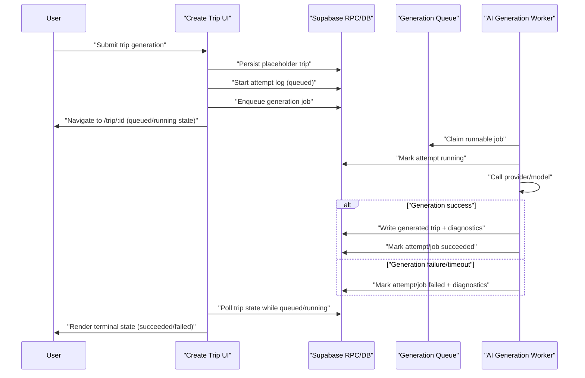
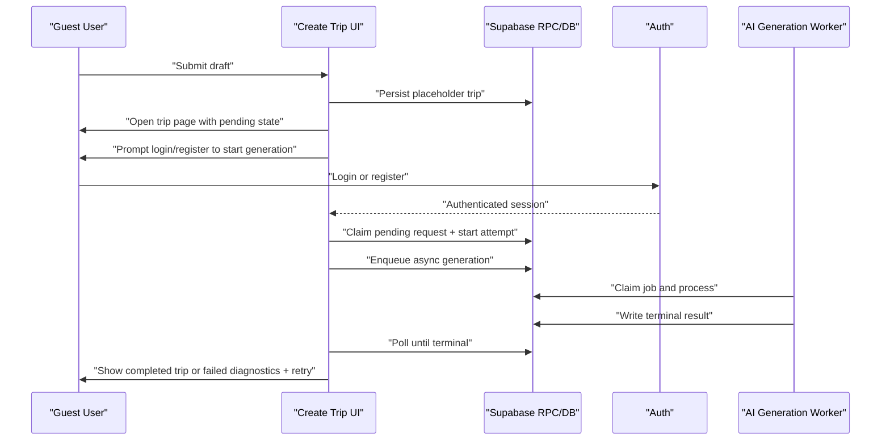
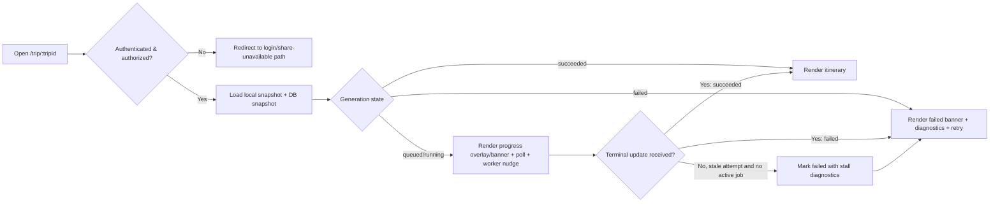
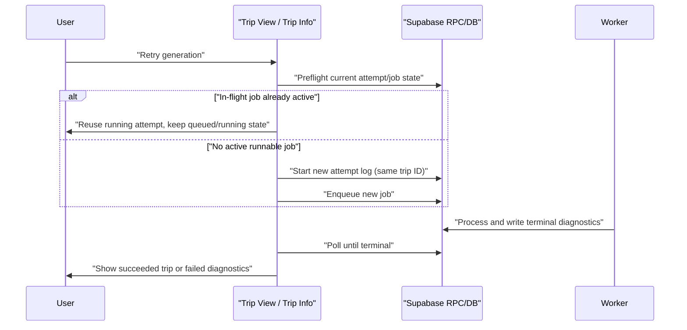

# AI Trip Generation Runtime Flows (Async Worker)

Status: draft  
Date: 2026-03-06

## 1. Create trip (authenticated)

## 2. Create trip (signed-out user with claim flow)

## 3. Open trip URL decision flow

## 4. Retry flow (same trip)

