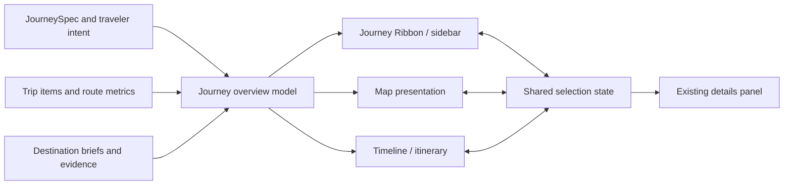

# JourneySpec Trip Visualization and Sidebar Concepts

Status: concepts implemented; Journey Lens integration is implemented behind a default-off TripView rollout

Reviewed: 2026-07-17

## Prototype checkpoint

The first two low-risk steps are now implemented without changing the live trip workspace:

- a pure, versioned overview adapter derives chapters, transfers, journey load, destination context, audience evidence, warnings, and provenance from structured or legacy trips;
- one Thailand circuit can be explored as Journey Lens, Route Storyboard, or Adaptive Inspector while city and transfer selection stays synchronized;
- the lab is lazy-loaded and fetch-free, so it does not add work to the normal planner path;
- the adapter is covered for a country circuit, a hub with a day trip, a legacy trip, and an over-tolerance transfer.

The next checkpoint is real-trip feedback on the provisional default and compact behavior. The integration remains default-off until that feedback confirms the information hierarchy and workspace fit.

The recommended hybrid now also has an additive TripView integration boundary for testing. It is disabled unless `VITE_TRIP_JOURNEY_OVERVIEW_ROLLOUT=tripview`, loads its model and visual code only when enabled, reuses the current city/transfer selection contract, compacts when the existing details panel opens, and becomes a focused chapter sheet on mobile. Its important chapter choices use the same product-neutral editorial tokens and accessible decision-card primitive as the route-first wizard. It does not add a map implementation, persistence key, or alternate item editor.

## Decision summary

TravelFlow should add a **Journey Lens** to the existing planner: a structured, collapsible route-story rail that makes the trip shape, bases, nights, transfer load, neighborhoods, traveler fit, and evidence understandable at a glance. Selecting a chapter or transfer in the lens should focus the same item on the map and timeline. The map, timeline, and lens remain three views of one trip graph.

The first prototype should combine:

- the persistent overview and quick scanning of **Concept A: Journey Lens**;
- the visual route spine and chapter storytelling of **Concept B: Route Storyboard**; and
- the contextual detail behavior of **Concept C: Adaptive Inspector**.

It should not begin as another full workspace mode or a large preparation dashboard. The rail is the stable navigation and orientation layer; detailed editing remains in the existing details panel.

## What the earlier experiment taught us

The previous `feat: add trip prep workspace` change (`7f97ea88`, reverted by `7db72d16`) added a parallel planner/prep mode across 31 files with about 1,600 added lines. It introduced a new global workspace switch, a separate full-page preparation surface, new persisted mode state, and broad locale and TripView changes. It was reverted the same day.

Useful ideas worth keeping:

- the planner stays the primary route-building canvas;
- route context remains visible beside support information;
- one main content surface plus one supporting rail is clearer than three equally weighted columns;
- preparation, sources, and warnings deserve first-class presentation rather than being buried in a modal.

What should change this time:

- add one synchronized view of the existing trip instead of a parallel application;
- derive a small display model from `ITrip`, `JourneySpec`, destination briefs, and the map presentation contract;
- prototype behind a lab/rollout flag before changing TripView persistence or routes;
- reuse the existing selection and details-panel behavior;
- make mobile a deliberate chapter sheet, not a compressed desktop sidebar.

## The missing visualization

A larger map alone does not explain the journey. The signature visualization should be a **Journey Ribbon**: a compact route spine where stays are chapters and transfers are bridges.

Each base chapter can show:

- city and selected neighborhood;
- nights and share of total trip time;
- key interests or audience-fit signals;
- planned versus open time;
- one defining dish, activity, or local character cue;
- freshness or uncertainty only when it changes a decision.

Each transfer bridge can show:

- mode and realistic duration range;
- travel-load weight relative to the whole trip;
- whether the leg is a necessary gateway, scenic choice, or avoidable hop;
- warnings when it breaks the traveler's transfer tolerance.

Day trips should orbit their base visually instead of reading like another accommodation change. Alternatives should appear as branches, not as if they are already committed stops.



## Shared information hierarchy

The same hierarchy should power all three concepts.

1. **Trip identity** — journey type, date span, duration, traveler setup, pace.
2. **Route shape** — bases, nights, day trips, entry/exit logic, round-trip state.
3. **Journey load** — total transfers, longest transfer, base changes, planned/open time.
4. **Chapters** — city character, base neighborhood, must-dos, food, audience fit.
5. **Decision support** — warnings, open choices, alternatives, weather-proof options.
6. **Why this plan** — template match reasons, tradeoffs, dataset version, source freshness.

The shell should stay flat, typographic, and calm. Color belongs to route chapters and state, not decorative chrome. One or two key moments may use a bold squircle or restrained route-drawing motion; the surrounding rail should avoid a pile of rounded cards.

## Concept A — Journey Lens

**Structure:** a 360–420 px persistent rail on wide desktop, next to the primary map/timeline canvas. It begins with a compact trip signature, then the Journey Ribbon, followed by one concise decision section.

**Interaction:** selecting a chapter focuses its city on the map and scrolls the timeline. Selecting a transfer focuses its route leg. The existing details panel still opens for editing an activity, city, or leg.

**Best qualities:**

- fastest overview without leaving the planner;
- smallest change to the current mental model;
- keeps the trip's “why” visible while editing;
- good base for camper legs and cruise port-day chapters later.

**Risks:** three simultaneous panes can become cramped when the existing details panel opens. The rail therefore needs compact and expanded states, and the map/timeline workspace must own a minimum-width policy.

**Best for:** the default planner experience.

## Concept B — Route Storyboard

**Structure:** a wider 440–520 px chapter canvas with a strongly visual vertical route spine. Stays read like editorial chapters; transfers bridge them; day trips and alternatives branch from the base. The map can float or occupy the remaining canvas.

**Interaction:** scrolling the story advances map focus. Expanding a chapter reveals neighborhoods, signature activities, food, and practical context. Reordering committed chapters remains a timeline action, not an implicit scroll gesture.

**Best qualities:**

- strongest visual identity and emotional sense of the journey;
- makes multi-city route logic and tradeoffs much easier to understand;
- can become a compelling read-only/shared-trip view and later a travel memory spine.

**Risks:** it can compete with the itinerary for editing space and can drift into a second timeline. It requires strict separation between “understand/select” and “schedule/edit.”

**Best for:** route reveal, read-only sharing, and an expanded overview mode.

## Concept C — Adaptive Inspector

**Structure:** a thin 72–88 px chapter index plus a contextual 320–400 px inspector that opens only when a city, transfer, warning, or decision is selected. A compact trip-signature strip stays visible above the main canvas.

**Interaction:** the index provides rapid chapter jumps; map or timeline selection changes the inspector. The inspector can show city context, transfer feasibility, audience fit, or provenance without permanently occupying full width.

**Best qualities:**

- preserves maximum map/timeline space;
- suits experienced planners and smaller laptops;
- provides a reusable contextual shell for specialist products.

**Risks:** the journey overview is less discoverable, and users must interact before they understand the whole route. It is a better compact state than the only default state.

**Best for:** compact desktop, tablet landscape, and focus-heavy editing.

## Recommended responsive system

| Viewport | Recommended behavior |
| --- | --- |
| Wide desktop | Journey Lens expanded; central planner; existing details panel opens contextually. |
| Standard laptop | Journey Lens compact by default; expanding it may temporarily collapse or overlay the details panel. |
| Tablet | Journey Ribbon opens as an inline-start drawer over the planner; selection remains synchronized. |
| Mobile | A compact journey signature sits above the itinerary; “Journey” opens a full-height chapter sheet with a mini-map header. |
| Shared/read-only trip | Route Storyboard may become the primary surface, with map and day details progressively disclosed. |

Implementation must use logical layout properties and should mirror inline placement for RTL locales. Route ordering remains chronological regardless of text direction.

## Proposed display contract

Create a pure, versioned `JourneyOverviewModel` rather than reading loosely from TripView components.

```ts
interface JourneyOverviewModel {
  version: 1;
  identity: {
    journeyType: string;
    durationDays: number;
    dateLabel: string;
    pace?: string;
    travelerTags: string[];
  };
  summary: {
    baseCount: number;
    dayTripCount: number;
    transferCount: number;
    transferMinutes: number;
    longestTransferMinutes?: number;
    openDecisionCount: number;
  };
  chapters: JourneyOverviewChapter[];
  warnings: JourneyOverviewWarning[];
  provenance?: {
    datasetVersion: string;
    templateKey?: string;
    compiledAt?: string;
  };
}
```

The adapter should:

- prefer canonical planning metadata when present;
- degrade gracefully for legacy, imported, and manually created trips;
- expose stable city/activity/route IDs compatible with current map and timeline selection;
- calculate summaries deterministically and cover them with unit tests;
- never fetch data or synchronize state inside the visual component.

## Low-risk implementation sequence

1. **Complete:** Build the pure overview-model adapter and fixtures for hub/day trips, circuit, legacy trip, and transfer warnings. Add city-break and incomplete-trip fixtures when their UI states enter the prototype.
2. **Complete:** Add an isolated concept lab with the same trip rendered in all three structures; no TripView route or persistence changes.
3. Test wide desktop, laptop, tablet, mobile, and RTL layouts; gather preference and comprehension feedback.
4. Select one default and one compact state. Validate the information hierarchy before polishing motion.
5. **Implemented behind a default-off rollout:** Integrate the Journey Lens using the existing selection and details-panel contracts; complete real-trip preview testing before selecting the production default.
6. Measure chapter selection, map/timeline handoff, rail collapse, warning interaction, and time to first edit.
7. Only then add preparation modules or child-app-specific chapter content.

## Concept evaluation criteria

Ask testers to identify, within ten seconds:

- how many bases the trip has and how long each stay is;
- which transfer is most demanding;
- where day trips originate;
- why the route fits their traveler setup;
- which parts are selected, optional, or still unresolved;
- where the recommendation came from and whether anything is stale.

The concept should be rejected or revised if it reduces map/timeline usability, duplicates itinerary editing, hides unresolved choices, or requires a full TripView state rewrite before it can be tested.
