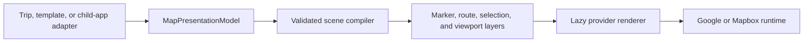

# Map presentation contract

## Purpose

TravelFlow's map renderer must be reusable by the core planner, route-first experiments, and future child applications without importing trip generation, `JourneySpec`, permissions, AI jobs, or persistence state.

## Stable boundary

`shared/mapPresentation.ts` is the serializable, provider-neutral input contract. It owns:

- marker identity, kind, coordinates, labels, category keys, and source metadata;
- route-leg endpoints, transport mode, geometry status, path, distance, and duration;
- selected marker or route identity;
- fit/focus viewport intent with logical padding; and
- source, dataset, and template provenance.

`shared/mapPresentationScene.ts` validates that input and resolves render-ready layers. Each route receives concrete start/end markers, each marker receives selected/focused/fit state, and viewport IDs become marker references. A provider never needs to understand TravelFlow timeline ordering or query product state to resolve these relationships.

## Adapter ownership

Feature adapters may understand their own product model. `services/tripMapPresentationAdapter.ts` is the TravelFlow trip adapter and is allowed to read `ITrip`/`ITimelineItem`. It preserves source item IDs for callbacks and route telemetry. Activities without dedicated coordinates receive their owning city's position in the neutral model while retaining city-fallback metadata, so the legacy renderer keeps its existing overlap behavior.

The shared contract and scene compiler must not import:

- `JourneySpec` or wizard state;
- AI prompt or generation-job types;
- database, auth, permission, or persistence services; or
- Google Maps or Mapbox runtime types.

## Live TripView path

TripView now memoizes a `MapPresentationModel` when its displayed trip changes and passes that contract through the typed `TripMapRendererProps` boundary. Selection remains a separate controlled value so choosing a timeline item does not rebuild all marker and route arrays. The heavy `ItineraryMap` provider implementation stays behind the existing lazy/Suspense boundary.

The current provider renderer temporarily adapts the neutral layers back to legacy timeline items internally. This preserves behavior while the provider-specific marker and route effects are extracted incrementally.

## Reuse path

A route-first experiment or child app can provide its own adapter and render the same map without creating an `ITrip`. It only needs to produce a valid `MapPresentationModel`. Provider selection, routing APIs, caching, and visual layers remain inside the renderer boundary.

## Next extraction boundaries

1. Make the provider renderer consume scene markers and route legs directly, removing the internal timeline-item back-adapter.
2. Replace city/activity-specific selection callbacks with a generic marker/route interaction event while preserving compatibility adapters for TripView.
3. Extract a provider-neutral timeline presentation contract so map and timeline can share selection without sharing product state.
4. Add a conditionally loaded map preview to the hidden route-first experiment once the direct scene renderer is available; do not add the heavy map bundle to the initial wizard step.
