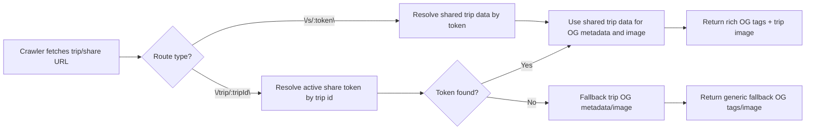

# Share Userflows

This document defines how TravelFlow resolves share links and direct trip links.

## Canonical rules

1. `/s/:token` is the canonical public/shared route.
2. `/trip/:tripId` is the owner planner route.
3. Owner and admin users stay on `/trip/:tripId`.
4. If a non-owner/non-admin opens `/trip/:tripId` and an active share token exists, the app routes to `/s/:token`.
5. If no active share exists:
   - logged-out users are sent to `/login` (with return-path memory),
   - logged-in non-owners are sent to `/share-unavailable`.

## Sharing flow chart

```mermaid
flowchart LR
  A["User opens a link"] --> B{"Route type?"}
  B -->|"\"/s/:token\""| C["Load shared trip via share token"]
  B -->|"\"/trip/:tripId\""| D["Attempt trip load with access context"]

  D --> E{"Owner or admin?"}
  E -->|"Yes"| H["Stay on \"/trip/:tripId\""]
  E -->|"No"| G["Resolve active share token via /api/trip-share-resolve"]
  G --> I{"Active share exists?"}
  I -->|"Yes"| J["Client route handoff to \"/s/:token\""]
  I -->|"No"| M{"Logged in?"}
  M -->|"No"| N["Navigate to \"/login\" with return path"]
  M -->|"Yes"| O["Navigate to \"/share-unavailable\""]

  C --> K["Render shared mode (view/edit)"]
  J --> C
  H --> L["Render planner route"]
```

## OG preview flow chart


