# Travel knowledge operations plan

Status: operational foundation, GeoNames/Wikidata identity ingestion, admin review, deterministic artifact staging, atomic activation/rollback, compact planning-context retrieval, and a published-catalogue admin surface implemented for Thailand; broader source adapters remain gated work

Owner: TravelFlow product/data engineering with explicit editorial review

## 1. Outcome

TravelFlow should continuously improve destination knowledge without turning production into an unreviewed web scrape. Every published fact, tag, entity, route template, and route leg must be traceable to:

- a registered source and its usage terms
- a retrieval or editorial observation time
- a normalized candidate change
- a review decision
- a published dataset version and checksum

The versioned repository dataset remains the reviewable source of truth. Supabase holds the published runtime projection and operational history. Generated bundles remain the zero-network fallback and rollback artifact.

## 2. Operating principles

1. Prefer licensed bulk data or official APIs over page crawling.
2. Never use an LLM as the source of a factual claim. It may extract a candidate from permitted source material or write original connective copy after the facts are fixed.
3. Never copy source prose or images into TravelFlow unless the license and attribution requirements explicitly permit it.
4. Do not crawl a website merely because it is publicly accessible. Record terms, robots policy, rate limits, and redistribution rights first.
5. Keep volatile facts out of long-lived packs unless they have `observed_at`, `valid_until`, and an automatic expiry path.
6. Publish reviewed dataset versions atomically. Do not expose a half-imported country pack.
7. Keep the prior published version available. Roll back by switching versions, not by deleting entities.
8. Keep evidence-aware audience signals scoped and expiring. Never publish universal `safe`, `family_friendly`, or `gay_friendly` booleans.

## 3. End-to-end pipeline

```mermaid
flowchart LR
    R["Registered source and license"] --> F["Fetch raw snapshot"]
    F --> N["Normalize candidates"]
    N --> D["Diff against published pack"]
    D --> A["Automated validation"]
    A --> H["Human editorial review"]
    H --> V["Build immutable version"]
    V --> S["Stage in Supabase"]
    S --> Q["Runtime and route QA"]
    Q --> P["Atomic publish"]
    P --> M["Freshness and quality monitoring"]
    M --> D
```



Raw snapshots and rejected candidates are never served to travelers. Only a published, validated dataset version is readable by the planner RPC.

## 4. Source tiers

### Tier A — automated structured ingestion

These sources are suitable for scheduled import when their license and API rules are captured in `travel_sources`.

| Source | Use | Access pattern | License and operational rule |
| --- | --- | --- | --- |
| [Wikidata](https://www.wikidata.org/wiki/Help:Data_access) | Canonical identities, aliases, coordinates, administrative relationships, official websites, selected classifications | Entity API or bounded SPARQL; country dumps when volume grows | Structured data is CC0. Send an identifying user agent, respect `429` and `Retry-After`, and prefer bulk access for high volume. |
| [GeoNames](https://www.geonames.org/export/) | Place-name reconciliation, alternate names, feature codes, population signals | Thailand country dump, not one request per entity | CC BY 4.0; retain attribution. Free web services have request limits, so the bulk dump is the default. |
| [OpenStreetMap / Geofabrik Thailand](https://download.geofabrik.de/asia/thailand.html) | Boundaries, neighborhoods, transport nodes, amenity and POI candidates, route graph inputs | Daily or weekly Thailand PBF extract | ODbL. Attribute OpenStreetMap contributors and keep OSM-derived database artifacts separable so share-alike obligations are clear. Do not bulk-query public Nominatim or Overpass instances. |
| [Wikimedia Analytics API](https://doc.wikimedia.org/generated-data-platform/aqs/analytics-api/documentation/access-policy.html) | A reproducible popularity signal based on destination-page interest | Monthly batched pageview requests or bulk analytics dumps | CC0. Use an identifying user agent, sequential requests, backoff, and a documented scoring window. Popularity is a relative signal, not visitor volume. |
| [IANA time zone database](https://www.iana.org/time-zones) | Canonical time-zone identifiers and changes | Release-based download | Public-domain data; update when a new IANA release is published. |
| [Thailand Open Government Data](https://www.data.go.th/pages/about-open-data) | Administrative, transport, tourism, environment, and public-facility datasets | Dataset API or downloadable files | Import only datasets whose individual license permits commercial reuse and redistribution. Store dataset ID, publisher, license version, and retrieval checksum. |
| [Thai Meteorological Department Open Data](https://www.tmd.go.th/en/service/serviceData) | Official forecasts, warnings, stations, and permitted climate products | Documented open-data API/RSS | Treat current forecasts and warnings as runtime data. Import historical climate only when the product license permits storage and redistribution. |
| [Wikimedia Commons](https://commons.wikimedia.org/wiki/Help:Machine-readable_data) | Optional destination imagery | MediaWiki API with per-file license metadata | Accept only approved commercial-use licenses. Persist author, license, source URL, modification state, and required attribution per file. |

### Tier B — official reference with manual review

These sources are valuable evidence but should not be automatically copied into the database unless written permission or an explicitly reusable feed exists.

| Source class | Examples | Allowed use |
| --- | --- | --- |
| National tourism authority | Tourism Authority of Thailand | A reviewer may confirm a fact and write an original TravelFlow summary with the source URL. Do not crawl or syndicate page copy or images; TAT terms prohibit automated copying without permission. |
| Attraction and park operators | Department of National Parks, museums, temples, local authorities | Confirm official identity, location, access rules, closure notices, and published price references. Volatile details require expiry. |
| Transport operators | State Railway of Thailand, Airports of Thailand, Department of Airports, BTS/MRT operators, ferry operators | Use official APIs or feeds when licensed. Otherwise store reviewed planning ranges and link travelers to the live operator for schedules and fares. |
| Heritage authorities | UNESCO World Heritage Centre and Thai cultural agencies | Confirm designation and official identity, but write original summaries. UNESCO/WHC republication requires authorization. |
| Audience specialists | IGLTA, local LGBTQ+ organizations, accessibility organizations | Evidence for scoped scene/supply/context tags only. Record date and source; do not infer universal safety or suitability. |
| Local editorial review | TravelFlow researchers and verified local contributors | Original judgments such as best base, trade-offs, hidden-gem score, realistic duration, and route feasibility. Every judgment records methodology and review date. |

### Tier C — licensed runtime providers

Weather forecasts, live schedules, availability, bookable prices, traffic, closures, advisories, and exchange rates should normally be fetched at runtime or into a short-lived cache. They are not permanent destination facts.

The provider contract must specify:

- fields that may be stored
- maximum cache duration
- display attribution
- map-provider restrictions
- commercial and AI/RAG permissions
- deletion or refresh obligations

### Excluded as a knowledge corpus

Do not build the TravelFlow database by scraping Google Maps, Tripadvisor, Booking.com, Airbnb, blogs, social networks, or similar commercial products.

- Google Places generally prohibits prefetching and long-term storage beyond documented exceptions such as place IDs.
- Tripadvisor permits only narrow licensed display use and prohibits caching or indexing most content.
- Reviews, ratings, photos, descriptions, and prices from commercial services must not become TravelFlow training or RAG data without a negotiated license.

These services may later be integrated as clearly separated live providers when their contract permits the exact product use.

## 5. Source precedence by data domain

| Domain | Primary source | Secondary check | Publication rule |
| --- | --- | --- | --- |
| Identity and hierarchy | Wikidata + GeoNames | Open government boundaries | Canonical ID mapping must be deterministic; ambiguous merges require review. |
| Coordinates and bounds | Open government or OSM extract | Wikidata/GeoNames | Flag coordinate differences above a type-specific distance threshold. |
| Names and aliases | Local official name + Wikidata/GeoNames | Editorial transliterations | Preserve local script, English canonical name, locale aliases, and historic names separately. |
| Neighborhoods | OSM/open government boundaries | Local editorial review | A neighborhood can be published without a formal polygon only when its editorial scope is documented. |
| POIs and amenities | OSM/open government candidates | Official operator page | Candidate existence is automated; traveler value, duration, and description are reviewed. |
| Popularity | Wikimedia pageviews + open visitor statistics | Template usage and traveler saves | Store component signals and scoring version, not an unexplained score. |
| Hidden-gem score | Tourism intensity versus traveler value | Local review | Never derive it only from low pageviews; require a positive value signal. |
| Weather and seasonality | TMD/open climate data | Reviewed tourism references | Packs contain climate normals and seasonal patterns; live forecasts stay outside the pack. |
| Food and dishes | Thai cultural/open government sources | Local editorial review | Store dish identity and regional relevance; write original descriptions. |
| Transfer ranges | Licensed routing graph and operator data | Repeated route sampling | Publish ranges with mode, assumptions, source date, confidence, and expiry. |
| Price bands | Official fees and reviewed samples | Licensed runtime providers | Store broad planning bands, currency, sample date, methodology, and short validity. |
| Audience context | Specialist/official evidence | Local reviewer | Require evidence note, confidence, scope, review date, and expiry. |
| Images | Wikimedia Commons or commissioned media | Manual license review | No image is published without machine-readable attribution and commercial-use approval. |

## 6. Refresh cadence

| Cadence | Data |
| --- | --- |
| Daily | Source availability, official alerts, OSM change extracts when the pipeline is mature; runtime-only weather and transport changes |
| Weekly | New/closed POI candidates, route feasibility probes, broken source URLs, facts approaching expiry |
| Monthly | Wikimedia popularity signals, currency basis, broad price samples, source-license/terms checks, template performance |
| Quarterly | TAT and local editorial review, neighborhood/base recommendations, dishes, activity durations, audience evidence, seasonal cautions |
| Annually | Full country reconciliation against Wikidata, GeoNames, OSM and government datasets; taxonomy and template portfolio review |
| Event-driven | Major closure, transport opening, disaster, legal change, source-license change, traveler correction with evidence |

Refreshing does not automatically mean publishing. A source run produces candidates; material changes still require review.

## 7. Deployed additive operational and activation tables

The existing `travel_*` catalog remains the published projection. The following controlled operational and activation tables were deployed on 2026-07-17 before any crawler or reviewed-data publish workflow was enabled:

### `travel_source_runs`

One row per fetch or editorial refresh:

- source, country, started/finished time, status
- fetcher version and configuration hash
- HTTP status/rate-limit summary
- raw item, candidate, warning, and error counts
- terms/robots fingerprint observed during the run

### `travel_source_snapshots`

Immutable metadata for raw inputs stored in a private object bucket:

- source run, source URL/dataset ID
- retrieval time, ETag, Last-Modified
- SHA-256 checksum, content type, byte size
- storage object key
- license key and terms URL captured at retrieval time

### `travel_change_candidates`

Normalized proposed changes, never public by default:

- target entity/template or proposed new entity
- field/fact/tag/leg being changed
- previous and proposed JSON values
- source snapshot, extraction method, confidence
- severity and automated validation findings
- candidate status: `new`, `needs_review`, `accepted`, `rejected`, `superseded`

### `travel_review_decisions`

Auditable human decisions:

- candidate, reviewer, decision, reason
- edited accepted value
- reviewed time and review-policy version

### `travel_dataset_artifacts`

Immutable output records:

- dataset version and parent version
- repository commit and source-run set
- pack/seed checksum and object location
- validation report and publish status
- staged, published, superseded, and rolled-back times

### `travel_dataset_payloads`

One immutable runtime pack per dataset version and locale:

- compiled pack and localized template-copy payload
- pack checksum, byte size, and validation report
- staged, published, or retired status

### `travel_active_datasets`

One small active pointer per country:

- active dataset version and artifact
- activation actor and timestamp
- atomically replaced only by the guarded publish or rollback RPC

### `travel_dataset_activations`

An immutable publish/rollback ledger:

- previous and target dataset/artifact IDs
- action, reason, actor kind, and timestamp
- metadata binding the activation to its repository commit

RLS must keep snapshots, candidates, and review data admin-only. Public clients can read only the published projection through the versioned pack RPC.

Production verification confirms that all eight operational and activation tables have RLS enabled. Snapshots, candidates, decisions, artifacts, and activation history remain admin-only; public access is restricted to the selected columns of the active pointer and its published payload. Raw snapshots remain append-only for authenticated admins. Review decisions are readable by admins but can be inserted only through the atomic review RPC, which records the immutable decision and updates candidate status in one transaction. The service role retains controlled retention access.

The private `travel-knowledge-snapshots` Storage bucket is capped at 50 MiB per object. It has no permissive browser policy and adds restrictive policies that continue denying this bucket if a broad Storage allow policy is introduced later. Fetchers upload with `upsert: false`; object deletion or replacement is never part of ingestion. Use the Storage API for object lifecycle work, never direct SQL against `storage.objects`.

## 8. Fetcher contract

Every source adapter implements the same contract:

1. Verify the source is active and the license permits the configured operation.
2. Send an identifying `User-Agent` with a TravelFlow contact URL.
3. Respect robots policy for HTML sources, even when the terms appear permissive.
4. Use conditional requests with ETag/Last-Modified and a per-host concurrency limit.
5. Stop and honor `Retry-After` on `429`; use bounded exponential backoff for transient failures.
6. Save the raw response and checksum before transformation.
7. Normalize into typed candidates without mutating published rows.
8. Emit structured diagnostics for schema drift, missing fields, conflicts, and license changes.
9. Never send source data to an LLM unless the source terms allow that processing.

HTML extraction is the last resort. A source-specific HTML parser requires a fixture, a contract test, and an alert when selectors or content fingerprints change.

## 9. Review and publish gates

A country version cannot publish unless:

- all source records have current terms and license decisions
- no orphan entity, duplicate canonical slug, invalid coordinate, or unknown tag exists
- every public fact and tag has a registered source
- expired evidence is removed from the public projection or renewed
- entity and template count deltas are explained
- route templates resolve to published entities and feasible sourced legs
- golden city-break, hub/day-trip, and circuit scenarios compile successfully
- generated SQL and bundled packs match the reviewed source dataset
- a staging import returns the expected counts and RPC payload checksum
- a rollback version is identified

The publish operation should be one reviewed command that stages the new version, verifies it, and then switches the published manifest pointer. Application flags remain a separate rollout control.

## 10. Continuous delivery model

1. A scheduled job runs fetchers and creates a machine-generated country-data branch only when candidate changes exist.
2. The pull request contains a human-readable diff: added/removed entities, changed facts, expiring evidence, template impact, source/license changes, and coverage metrics.
3. CI runs dataset validation, seed/pack reproducibility, route compiler tests, performance guards, and license/attribution checks.
4. Reviewers accept, edit, or reject candidates. The bot regenerates artifacts from accepted decisions.
5. Merge creates an immutable dataset artifact but does not immediately expose it.
6. A staging Supabase import and smoke test run against that artifact.
7. Publishing switches the active dataset version atomically and records the operator.
8. The bundled fallback is updated in the same release or remains on the prior known-good version until the next app deployment.

## 11. Quality metrics

Track these per country and dataset version:

- entity coverage by type and destination importance
- cities with recommended neighborhoods, food, activities, arrival context, and route connectivity
- facts by source tier, confidence, age, and expiry state
- public tags without current evidence
- route templates with missing or stale legs
- candidate acceptance/rejection and source-conflict rates
- source run freshness, failures, rate limiting, and schema drift
- planner fallback rate and remote-pack latency
- traveler corrections and recommendation hide/remove rates
- unsupported entity IDs and factual-support rate in generated trips

## 12. Thailand rollout sequence

### Stage 1 — current reviewed pack

- [x] Deploy the additive schema and Thailand v5 seed.
- [x] Keep bundled fallback enabled until production counts, RLS, and the pack RPC pass.
- [x] Record and activate the first immutable database artifact; future publishes now retain the prior artifact as a rollback target.
- [x] Prepare Thailand v6 with 277 facts and richer operational metadata for four Bangkok activities.
- [x] Add a bounded, version-safe planning-context RPC and expose retrieval provenance in the route-first wizard.
- [x] Add a searchable published-catalogue view to the admin workspace while preserving the separate review queue.
- [x] Publish Thailand v11 with 571 sourced facts and rich category-aware coverage for all 32 current activity POIs while retaining v10 for immediate rollback.
- [x] Publish Thailand v12 with 27 route templates so all 15 supported cities have a directly selectable city-break concept while retaining v11 for immediate rollback.
- [ ] Publish Thailand v13 with at least two source-backed base areas for all 15 supported cities while retaining v12 for immediate rollback.

### Stage 2 — freshness and source registry

- [x] Add the operational tables above.
- [x] Register Wikidata, GeoNames, IANA, Wikimedia Analytics, OSM/Geofabrik, data.go.th, TMD Open Data, Wikimedia Commons, and the current manual/editorial sources with explicit ingestion modes and storage rules.
- [x] Add a deterministic freshness/license audit to the repository quality gate before adding any crawler.
- [x] Add a read-only Monday audit workflow; GitHub will begin running it from the default branch after this feature merges.
- [x] Persist source-run summaries, immutable snapshot metadata, and review-only candidates for the first bounded ingestion worker.

The current commands are:

```bash
pnpm travel-knowledge:audit
pnpm travel-knowledge:generate-source-registry
pnpm travel-knowledge:check-source-registry
pnpm travel-knowledge:ingest -- --source all --country TH
pnpm travel-knowledge:verify-snapshots
```

Ingestion is dry-run by default. A server-side write requires both `--persist` and `TRAVEL_KNOWLEDGE_WRITE_MODE=review_candidates_only`; it also requires the server-only Supabase key. Never set that key in a browser-visible environment variable. The first live run stored four source snapshots and produced 32 `needs_review` identity candidates without changing any published entity. A repeated run created zero duplicate candidates; checksum and conditional-request reuse skipped unchanged snapshots.

`pnpm travel-knowledge:check` runs the dataset validator, Thailand artifact reproducibility checks, registry reproducibility check, and freshness/license audit together. It fails on expired evidence, overdue source content, overdue license reviews, source/registry drift, or an unregistered published source. Warnings surface upcoming reviews and missing directly dated evidence without silently blocking an unrelated application build.

The monthly identity workflow always runs a dry reconciliation first. It persists only when the repository secrets `TRAVELFLOW_SUPABASE_URL` and `TRAVELFLOW_SUPABASE_SERVICE_ROLE_KEY` exist; until then, scheduled persistence exits successfully with a warning. A manual run can request persistence explicitly, and fails closed when either secret is missing.

### Stage 3 — safe automated ingestion

- [x] Build Wikidata/GeoNames identity reconciliation first, limited to the Thailand country plus 15 route cities.
- [x] Use the GeoNames country dump rather than per-entity web-service requests and keep Wikidata requests to one bounded SPARQL query plus one label batch.
- [x] Save source payloads with retrieval metadata and SHA-256 checksums before producing candidates.
- [x] Keep all resulting external-ID changes in `needs_review`; do not mutate the published pack.
- [x] Add an admin review queue with source links, structured before/after values, validation findings, review reasons, and atomic accept, edit, reject, or request-changes decisions.
- [x] Keep review and publishing separate; a terminal candidate decision cannot change the published destination pack.
- [x] Materialize only accepted, supported review changes into a new repository dataset version before generating an artifact.
- [x] Bind every deterministic pack, seed, source-run set, and accepted decision set to checksums and a repository commit.
- [x] Stage immutable payloads privately, then publish or roll back with one guarded transaction and an immutable activation record.
- Add Wikimedia popularity and OSM POI candidates next.
- Add government/TMD adapters only for individually licensed datasets.
- Keep TAT, UNESCO, audience context, food, neighborhood judgment, and route-template copy in editorial review.

Artifact commands are dry-run first and require a distinct write-mode confirmation for each mutation:

```bash
pnpm travel-knowledge:materialize-reviews -- --version <version> --generated-at <timestamp>
pnpm travel-knowledge:stage-artifact
pnpm travel-knowledge:activate-artifact -- --publish <artifact-id> --reason <reason>
pnpm travel-knowledge:activate-artifact -- --rollback <artifact-id> --country TH --reason <reason>
```

### Stage 4 — contributor and traveler corrections

- Add evidence-backed correction submissions linked to canonical entities.
- Queue submissions as candidates; never write directly to published facts.
- Measure recurring corrections to prioritize weak sources and missing local review.

### Stage 5 — repeatable country onboarding

- Turn the Thailand source matrix, validators, template scenarios, and review checklist into a country-pack template.
- Require the same minimum city depth and route-quality gates before another country becomes public.
