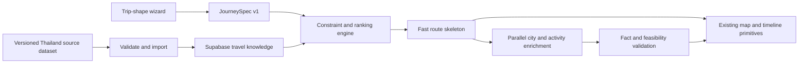

# Trip Generation Foundation: JourneySpec + Thailand Knowledge

Status: active implementation plan

Initial scope: Thailand only

Existing creator status: preserved; all rollout work is additive and feature-gated

## 1. Product outcome

TravelFlow should return a useful, editable route quickly from trusted destination data, then enrich it progressively. The first release proves that approach for Thailand and supports three trip shapes:

- city break
- one base with day trips
- single-country circuit

The first release intentionally defers camper routing, cruise schedules, detailed family settings, group preference negotiation, and other specialist traveler profiles. The contracts must leave room for those features without coupling them into the first implementation.

## 2. Locked decisions

1. `JourneySpec` becomes the versioned input contract between creation experiences and planner generation.
2. Countries, regions, cities, neighborhoods, and places use stable canonical entity IDs and slugs.
3. Supabase Postgres is the runtime source for published travel knowledge. Versioned repository data remains the reviewable import and rollback source.
4. Structured filters and deterministic rules handle geography, duration, tags, and feasibility. Embeddings are reserved for matching free-text wishes in a later phase.
5. The LLM may select known entity IDs and write connective explanations. It must not be the authoritative source for destination facts.
6. The current classic creator, wizard, trip schema, and TripView remain available until the new path meets rollout gates.
7. Thailand is the only country in the initial dataset. Depth and data quality matter more than global coverage.
8. Remote knowledge reads remain behind `VITE_TRAVEL_KNOWLEDGE_REMOTE_ENABLED=true` until the additive schema and RPCs are deployed and verified; the versioned bundle is the zero-network fallback.
9. `VITE_CREATE_TRIP_SHAPE_ROLLOUT` controls product exposure without changing URLs: `off` preserves the classic and V3 creators, `wizard` replaces only `/create-trip/wizard`, and `primary` uses the Thailand shape planner on both creator surfaces.

## 3. Safety, backup, and rollback

- Preserve the pre-change Git commit on `codex/baseline-before-journey-spec-20260716`.
- Preserve existing untracked workspace files in the external Codex backup directory.
- Keep database work additive: new tables, views, functions, and policies only.
- Never rewrite existing trips during the foundation phase.
- Store the source dataset version on every compiled destination pack and generated trip trace.
- Roll back the product path by disabling the experiment route/flag; old creators continue to operate.
- Roll back knowledge data by republishing the prior dataset version, not by deleting entities.

## 4. Target architecture

The architecture separates four concerns:

- **Product intent:** `JourneySpec`, wizard branching, selected route concept.
- **Knowledge:** canonical entities, sourced facts, tags, templates, dataset versions.
- **Planning:** constraints, ranking, route skeletons, day allocation, validation.
- **Presentation:** maps, markers, route lines, timelines, cards, and interaction primitives.

No map component should depend directly on wizard state or AI prompt types. Presentation receives normalized entities, coordinates, route legs, selections, and callbacks.

## 5. Database model

### 5.1 `travel_entities`

Canonical hierarchy for `country`, `region`, `city`, `neighborhood`, `poi`, `port`, and `campground`.

Core fields:

- stable UUID and canonical slug
- parent entity and ISO country code
- primary name, local name, timezone
- latitude, longitude, and optional geographic bounds
- publication status and dataset version
- typical minimum/maximum stay
- popularity, hidden-gem, and tourism-intensity scores
- type-specific attributes in constrained JSONB

Coordinates remain plain numeric fields for the initial portable schema. Add a PostGIS geography projection and spatial indexes when the remote migration toolchain can validate them locally.

### 5.2 `travel_entity_names`

Localized names, endonyms, exonyms, and search aliases. The wizard must resolve “Bangkok,” “Krung Thep,” and localized variants to one canonical entity.

### 5.3 `travel_sources`

Source registry containing license, attribution, terms URL, commercial/redistribution permissions, and refresh cadence. A source must be registered before its facts or tags can be published.

### 5.4 `travel_entity_facts`

Typed factual claims such as recommended duration, climate summary, transport context, typical price band, signature dishes, airport transfer, or seasonal caution.

Every fact includes:

- fact key and JSON value
- optional unit and locale
- source
- observed, valid-from, valid-until dates
- confidence and review status
- explicit public/private publication state

### 5.5 `travel_tags` and `travel_entity_tags`

Controlled taxonomy with relevance and evidence. Initial groups:

- trip shape: `city_break`, `day_trip_base`, `country_circuit`
- experience: `beaches`, `food`, `culture`, `nightlife`, `nature`, `wellness`, `adventure`
- place character: `essential`, `hidden_gem`, `busy`, `quiet`, `walkable`, `island`
- practical: `good_public_transport`, `flight_hub`, `rainy_day_options`
- audience context: `lgbtq_scene`, `solo_travel_interest`, `family_activity_supply`

Avoid an unsupported universal `safe` or `gay_friendly` boolean. Audience tags require evidence level, source, and optional expiry.

### 5.6 `travel_templates`

Premade, versioned route concepts filtered by country, trip shape, duration, pace, and season.

Supporting tables:

- `travel_template_copy` for localized title, summary, and highlights
- `travel_template_stops` for ordered bases, day trips, optional stops, and night ranges
- `travel_template_legs` for sourced transfer modes, duration ranges, round trips, confidence, and freshness
- `travel_template_tags` for experience and character matching

Templates are route skeletons, not fully generated prose. Examples for Thailand:

- Bangkok long weekend
- Bangkok base with Ayutthaya day trip
- Northern Thailand culture and food
- Bangkok, Chiang Mai, and an island first-timer route
- Southern islands with a quieter alternative

### 5.7 `travel_dataset_versions`

Publishable dataset manifests with version, checksum, source snapshot, entity counts, generated time, and publication time. Cache keys and generation traces include this version.

## 6. Thailand dataset scope

The current `2026.07.17-v5` seed contains 84 canonical entities, 244 sourced facts, 405 evidence-aware tags, 15 route templates, and 16 sourced route legs. It includes activity coverage for every required template base, including the Gulf-island circuit across Ko Samui, Ko Phangan, and Ko Tao. It remains a broad planning foundation rather than a claim of complete destination coverage; deeper food, audience, accessibility, and live-operational data remains additive work.

### 6.1 Canonical places

Initial country hierarchy should cover, at minimum:

- Bangkok
- Chiang Mai
- Chiang Rai
- Ayutthaya
- Sukhothai
- Kanchanaburi
- Phuket
- Krabi / Ao Nang
- Koh Samui
- Koh Phangan
- Koh Tao
- Pattaya
- Hua Hin
- Pai
- Khao Sok
- Koh Lanta

Initial neighborhoods should prioritize the places needed for useful base recommendations, including Bangkok, Chiang Mai, and Phuket. Examples include Bangkok Riverside, Old Town/Rattanakosin, Chinatown/Yaowarat, Ari, Silom, Sukhumvit, Chiang Mai Old City, Nimman, Riverside, Phuket Old Town, Kata, Karon, and Kamala.

### 6.2 Information per city

- canonical and local names
- coordinates, timezone, parent region
- recommended stay range
- popularity and tourism intensity
- strengths and tradeoffs
- best months and seasonal cautions
- typical hotel, meal, and local-transport price bands
- arrival gateways and common transfer ranges
- neighborhood/base recommendations
- signature dishes and food areas
- activity and attraction candidates with approximate duration
- day-trip candidates
- experience and audience evidence tags
- source and freshness for every publishable fact

### 6.3 Initial source policy

Prefer official tourism and government sources for current facts, Wikidata/GeoNames for canonical identity, and licensed/open mapping data for geography. Editorial judgments such as “best base” or “hidden gem” must be labeled editorial and reviewed. Volatile prices, opening hours, advisories, and exchange rates are not stored as permanent truth.

## 7. JourneySpec v1

`JourneySpec` is immutable input data for one planning attempt.

Required concepts:

- contract version
- trip shape
- exact or flexible date window
- duration
- canonical place selections with roles
- entry and exit entities
- route locks and round-trip intent
- pace and maximum transfer/base-change constraints
- transport preferences
- interest tags and free-text notes
- source creator and experiment version

Place roles:

- `country_scope`
- `entry`
- `exit`
- `base`
- `must_visit`
- `day_trip`
- `consider`
- `avoid`

Adapters translate the existing create-trip preference structure into `JourneySpec` so both old creators continue working while the new path is developed.

## 8. Wizard v1

The first experiment uses five short steps plus a route reveal:

1. **Trip shape:** city break, base and day trips, or Thailand circuit.
2. **Starting point:** known city/cities, known dates, or inspiration.
3. **Timing:** exact dates or flexible duration and season.
4. **Travel rhythm:** relaxed/balanced/full, maximum base changes, maximum transfer.
5. **Interests:** a short set of bold selectable cards; advanced details stay collapsed.
6. **Route reveal:** compare up to three premade or compiled concepts before day-level enrichment.

The wizard writes `JourneySpec` directly. It must not maintain a second set of loosely related prompt state.

### Speed versus detail

- Default path asks only high-impact questions.
- “Tune this trip” reveals advanced constraints without blocking progress.
- Existing preferences can prefill later trips.
- Every step supports Back without losing state.
- Route concept cards appear from cached templates before AI enrichment begins.

## 9. Visual direction

### Application scaffolding

- flatter surfaces
- fewer rounded containers
- little or no decorative shadow
- visible grid, spacing, typography, and dividers establish hierarchy
- CSS logical properties and RTL-safe layout from the start

### Decision cards

- bold destination colors with accessible contrast
- squircle-style geometry reserved for important choices
- restrained rotation and rough/scribbled decorative marks
- pressed/selected states using transform and color
- entrance choreography focused on the route reveal
- no motion-dependent information and a reduced-motion path

The memorable moment should be the route concept reveal, not animation on every control.

## 10. Reusable map and route platform

Extract normalized primitives rather than copying TripView:

- `MapViewport`
- `MapMarkerLayer`
- `MapRouteLayer`
- `MapSelectionLayer`
- `RouteSummary`
- `TimelineViewport`
- `PlaceCard`

These accept data and callbacks only. Product-specific permissions, AI state, trip persistence, and wizard rules remain in feature adapters.

## 11. Generation and performance plan

1. Resolve `JourneySpec` selections to canonical entities.
2. Fetch one versioned Thailand destination pack.
3. Apply hard filters and choose matching templates.
4. Return up to three route skeletons immediately.
5. Compile the selected skeleton into normalized cities, route legs, and day budgets.
6. Enrich cities and activities in parallel.
7. Ask the LLM to select only known candidate IDs and write concise explanations.
8. Validate entity IDs, duplicate activities, transfer budgets, and unsupported claims.
9. Persist dataset, template, ranker, prompt, and model versions.

The deterministic path builds one immutable lookup index per loaded destination pack and reuses it across wizard resolution, template ranking, destination briefs, skeleton compilation, and activity enrichment. This avoids repeatedly scanning the same country dataset as coverage grows.

The wizard prepares and applies route concepts only when the traveler asks to compare them. Browser telemetry records destination-pack loading, template ranking/application, route-reveal readiness after paint, and skeleton/enrichment compilation separately. A revealed comparison remains bound to the exact dataset version and source that produced it, so a later remote refresh cannot silently mix versions or invalidate the selected route.

Initial targets:

- cached concept response p50 below 2 seconds
- uncached skeleton p95 below 5 seconds
- useful editable trip p50 below 8 seconds
- zero unsupported entity IDs
- factual source-support above 95 percent

### 11.1 Deterministic engine baseline

Run `pnpm travel-knowledge:benchmark` to measure the local, cached planning engine independently from network, browser rendering, persistence, and optional AI enrichment. The command benchmarks `JourneySpec` creation, template ranking, template application, skeleton compilation, and knowledge enrichment for every initial trip shape. It fails when pack parsing exceeds 50 ms p95, a route concept exceeds 100 ms p95, or an enriched trip exceeds 250 ms p95.

Baseline recorded on 2026-07-17 with 300 measured iterations and 30 warmups per scenario:

| Scenario | Route concept p95 | Knowledge-enriched trip p95 |
| --- | ---: | ---: |
| Bangkok four-day city break | 0.037 ms | 0.078 ms |
| Bangkok five-day hub and day trips | 0.013 ms | 0.038 ms |
| Thailand twelve-day circuit | 0.049 ms | 0.154 ms |

The `2026.07.17-v5` English pack is 445,767 bytes raw and 39,185 bytes gzip; localized template copy is 16,394 bytes raw and 4,794 bytes gzip. Pack JSON parsing measured 0.762 ms p95. These are machine-specific engineering baselines, not end-user latency claims. Product rollout continues to use the full response-time targets above.

## 12. Rollout phases

### Phase A — contracts and database foundation

- additive SQL schema and RLS
- `JourneySpec` v1 and legacy adapter
- repository dataset schema and validation
- Thailand source registry and first canonical entities
- dataset version and rollback workflow

### Phase B — Thailand depth

- cities, neighborhoods, tags, facts, route templates, and realistic template legs
- generated seed SQL and import validation
- read service with local versioned fallback
- admin-only data diagnostics

### Phase C — wireframe wizard

- hidden experimental route plus a default-off `off` / `wizard` / `primary` rollout
- trip-shape flow and first-class place selection
- template-backed route reveal
- funnel analytics and browser coverage

### Phase D — progressive planner

- route skeleton compiler
- compact, source-backed destination briefs persisted with each skeleton
- ranked neighborhood and activity candidates that preserve traveler selections and preference matches
- deterministic knowledge enrichment that materializes ranked POIs in the editable trip before any AI request
- item-level canonical entity, recommendation-origin, rank, source, dataset, and compiler provenance
- evidence-aware audience signals that do not imply universal safety or suitability
- parallel destination enrichment for live and long-tail details
- normalized adapter into the existing TripView
- latency, factual support, and constraint telemetry

### Phase E — visual system and reusable primitives

- editorial shell tokens
- playful decision-card tokens and motion
- extracted map/route/timeline primitives
- responsive, RTL, keyboard, and reduced-motion validation

### Later bucket

- detailed family and individual traveler profiles
- accessibility and dietary constraint expansion
- group voting and preference negotiation
- cruise port-day product
- camper vehicle/routing product
- other child-app experiments

## 13. Verification gates

- SQL source validates and remains idempotent.
- Every public table has RLS and explicit read/write policy intent.
- Dataset validation rejects orphan hierarchy, duplicate slugs, unknown tags, invalid coordinates, unsupported facts, and missing sources.
- `JourneySpec` unit tests cover each initial trip shape, invalid roles, normalization, and legacy conversion.
- Wizard browser tests cover branch order, state retention, validation, analytics, keyboard operation, and mobile layout.
- Existing create-trip browser tests and `pnpm test:core` remain green.
- `pnpm i18n:validate`, `pnpm supabase:validate`, and release-note validation pass.
- React Doctor does not regress after substantial wizard work.

## 14. Operational ownership

- GitHub issues track each phase and link to one umbrella epic.
- The repository dataset is reviewed like code and produces deterministic SQL.
- Publishing a dataset requires a new version, validation output, source diff, and rollback version.
- Volatile facts require explicit refresh cadence; expired facts are not silently presented as current.
- No production database migration is applied without a successful remote backup or verified platform snapshot.
